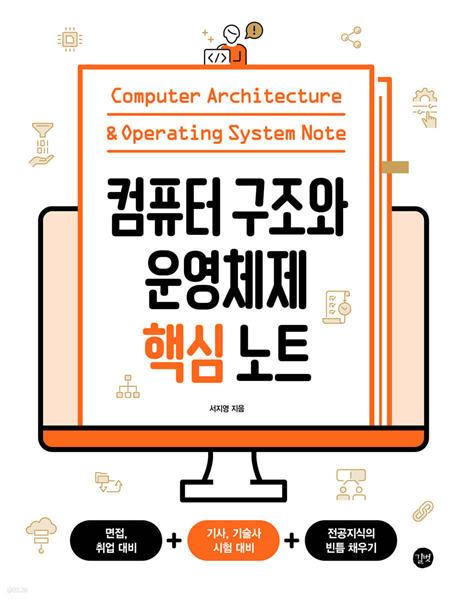
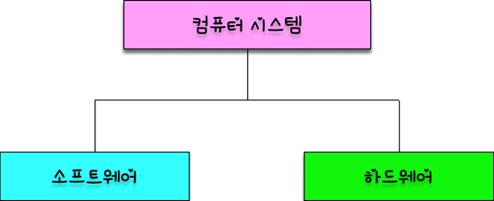

# 컴퓨터 구조와 운영 체제 핵심 노트

## 목차

## 책 소개 
---

 

부족한 CS 전공 지식을 채우기 위해 읽은 책입니다.

 

## 1부 컴퓨터 구조

## 1-1. 컴퓨터 기본 구조
---

  <figure style="text-align: center;">
    
    <figcaption>컴퓨터 시스템은 소프트웨어, 하드웨어로 구성</figcaption>
  </figure>

