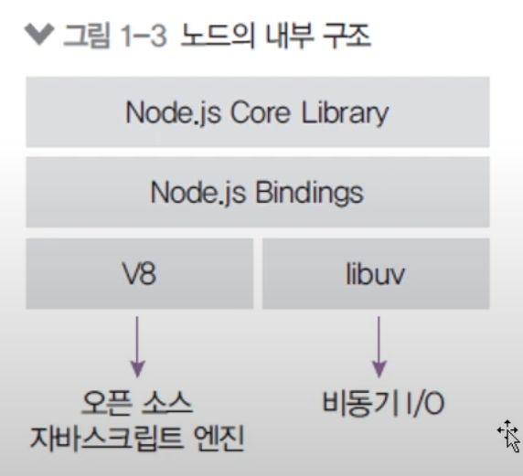

# 색션 0 정리

## 목차

### 질문하는 방법 및 강사의 당부

1. 강의을 들을땐 질문을 바로 한다. 
   - 말을 빙빙 돌린다거나 제목을 엉뚱하게 적는다거나 질문을 위한 게시판이 아닌 곳에 질문을 올리는 경우가 많음
2. 문제 상황을 구체적으로 말해야한다.
   - 무엇을 위한 코드인지 밝히질 않음'
   - 에러 메시지의 일부만 가져다줌
   - 코드를 안보여줌
3. 코드의 가독성을 높일 것
   - 가독성이 안좋은 코드는 문제 해결을 어렵게 함 (시간을 잡아먹음)
4. 문제를 해결하기 위해 시도했던 방법들을 먼저 알려줘야함
   - 시도했던 방법을 알려주면 문제 해결을 좀 더 빨리 할 수 있음
5. 버전을 먼저 알려줘야함
   - 간단하게 버전 때문에 실행이 안되는 문제도 상당히 많음
6. 에러 메시지는 번역기를 사용해서라도 모두 읽어보는 것이 도움이 되며, 질문을 할때 텍스트 형식으로 전달해주는 것이 좋음
7. 에러 메시지는 온전하게 건네줄 것
8. 회사 일에 대해선 질문 X
9. 강좌 하나 끝나면 다른 수강생의 질문들도 한번씩 볼 것 (무슨 질문을 했는지)
 
 

### 노드와 자바스크립트에 대하여

1. 노드는 서버가 아니다
   - 노드는 자바스크립트 런타임 (※ 런타임은 간단하게 `실행기`라고 생각하면 된다.)
   - Node.js가 없었을때 자바스크립트를 실행시키려면 스크립트가 써져있는 HTML 파일을 브라우저에서 실행시켜야했음
2. 노드를 공부하려면 자바스크립트를 먼저 공부하는게 좋다. (사실 공부해야한다.)
   - 추천 사이트 [[자바스크립트 튜토리얼](https://ko.javascript.info)]
   - 만약 자바스크립트를 공부한 후에 코딩이 잘 안된다면 그건 자바스크립트에 대한 공부가 부족한 것이 아닌 `프로그래밍적 사고가 부족한 것`이다.
3. 자바스크립트 내부는 C 또는 C++로 되어있다.
   - But, 생산성이 좋지않아 C 또는 C++ 대신 자바스크립트를 사용하는 것
4. 자바스크립트는 싱글 스레드이면서, 비동기가 가능한 것이 장점(libuv가 중요) 
   
   