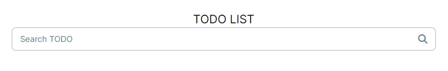

`ui.tsx` 생성

- 이유 : page.tsx는 서버 컴포넌트 / 클라이언트 관련 코드를 잡기 어려움. 따라서 화면 구현 페이지를 따로 생성

 
 

  
   
  Input 칸 오른쪽에 있는 아이콘은 font-awesome 페이지에서 아이콘을 찾아 코드를 기입하면 된다.
   
  사용가능한 아이콘은 
  <a href="https://fontawesome.com" target="_blank">링크</a>
  에서 찾아볼 것

   
 
 
